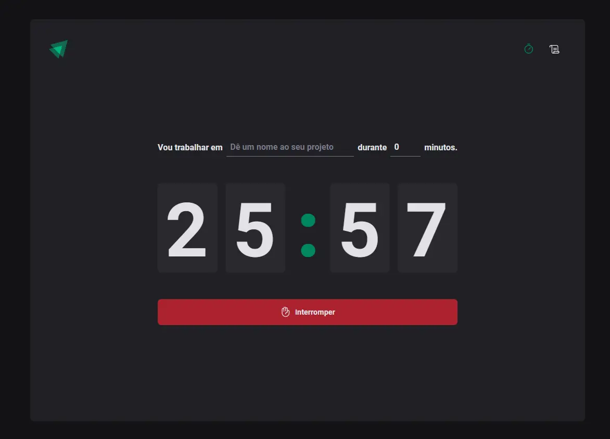
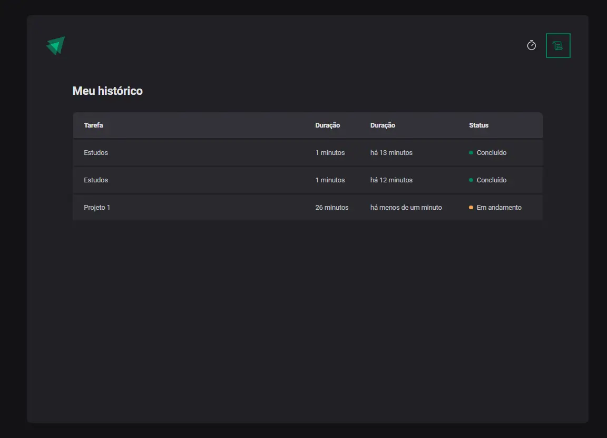

# Ignite Time

Temporizador para registrar o tempo gasto em uma atividade especifica.



## Instalação

Para fazer a instalação basta executar o próximos passos em sequência.

```bash
git clone https://github.com/guilhermanosilva/ignite-timer.git
```

```bash
cd ignite-timer
```

```bash
npm install
```

## Execução

É necessário ter o nodejs instalando em seu computador.

Para rodar o projeto localmente basta executar o seguinte comando em seu terminal:

```bash
npm run dev
```

Após o código entrar em execução um endereço semelhante a http://localhost:5174 será exibido em seu terminal.
Basta acessá-lo em qualquer navegador para ver o timer em execução.

## Funcionalidades

- Executa o contador em tempo decrescente
- Contabiliza o tempo informado
- Registra as atividades no histórico
- Informa se a atividade já foi concluída se está em execução na tela de histórico



## Contato

Guilhermano Silva - [LinkedIn](https://www.linkedin.com/in/guilhermanosilva) - guilhermanosilva@gmail.com

<br>

_Este projeto foi feito a partir de um curso da [Rocketseat](https://app.rocketseat.com.br/)_
